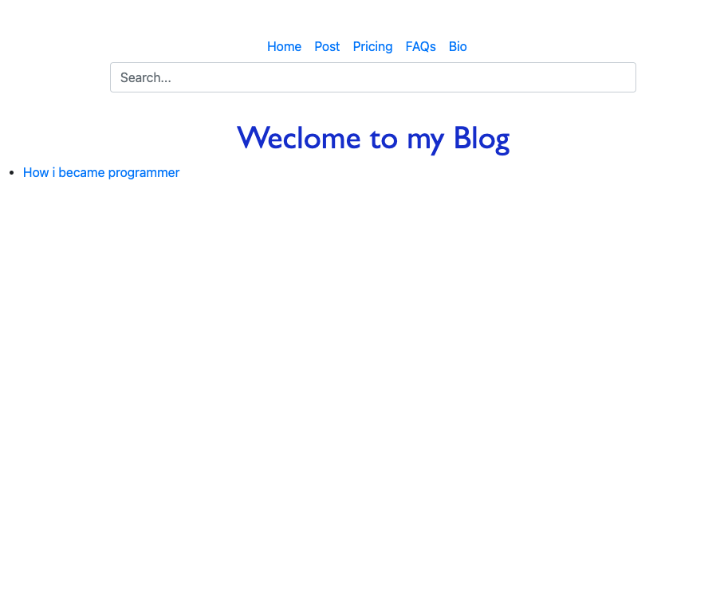
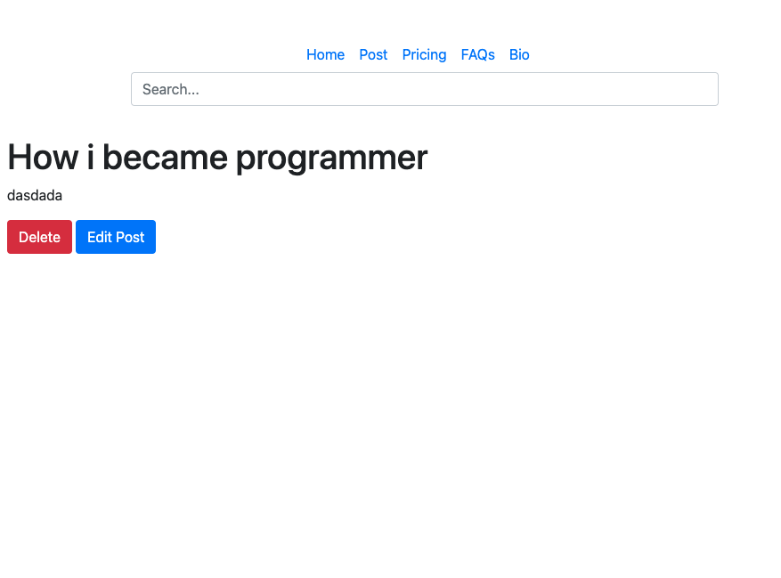
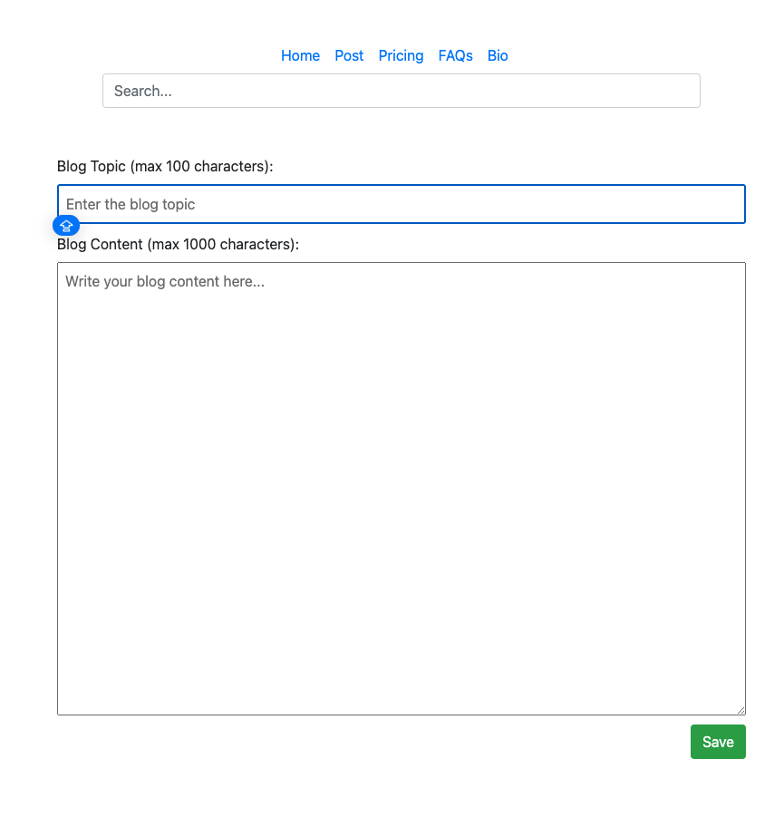

Blog Application
A simple blog platform built with Node.js and Express.
Overview
This project is a basic blogging platform that demonstrates server-side rendering with Express and EJS templates.
Features

View blog posts
Edit blog posts
Delete blog posts
Simple and clean design
Server-side rendered pages

Tech Stack

Node.js
Express.js
EJS templating
CSS for styling

Getting Started
Prerequisites

Node.js (v14 or later)
npm or yarn

Installation

Clone the repository:
Copygit clone https://github.com/Pacholekk/Blog.git

Navigate to the project directory:
Copycd Blog

Install dependencies:
Copynpm install

Start the server:
Copynpm start
Or use nodemon for development:
Copynpm run dev

Open your browser and visit http://localhost:3000

Project Structure
CopyBlog/
├── public/           # Static assets (CSS, images)
├── views/            # EJS templates
│   ├── partials/     # Reusable template parts
│   └── pages/        # Page templates
├── routes/           # Express routes
├── app.js            # Main application file
└── package.json
Future Enhancements

User authentication
Database integration (MongoDB)
CRUD operations for blog posts
Comments functionality
Admin dashboard

License
This project is licensed under the MIT License - see the LICENSE file for details.
Contact
Patryk Pacholski - GitHub
